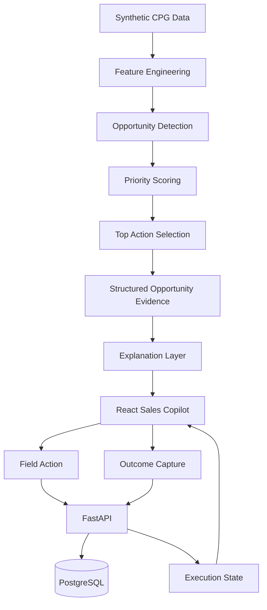

# SalesForge Architecture

## 1. System Overview

SalesForge is an outlet-level CPG sales-execution system built around a deterministic opportunity engine and a stateful execution layer.

The system follows:

```text
Data
  ↓
Feature Engineering
  ↓
Opportunity Detection
  ↓
Priority Scoring
  ↓
Top-Action Selection
  ↓
Explanation
  ↓
Field Execution
  ↓
Outcome Capture
  ↓
Execution State
```

The central architectural decision is that **deterministic analytics owns business decisioning**, while the AI layer is downstream and responsible for communicating the decision using supplied evidence.

---

## 2. High-Level Architecture



---

## 3. Data Foundation

The project uses a controlled synthetic CPG environment rather than proprietary customer data.

The base generator creates:

- Territories
- Distributors
- Sales representatives
- Outlets
- Products
- Orders
- Order items
- Inventory snapshots
- Visits
- Targets

The primary analytical period is:

```text
2025-01-01 → 2025-12-31
```

The data generator uses a fixed seed so the environment can be reproduced.

### Why synthetic data?

Outlet-level CPG sales-execution data is generally commercially sensitive. Controlled synthetic data provides two useful properties for a portfolio project:

1. The complete data pipeline can be shared.
2. Known scenarios can be planted and evaluated.

The planted scenarios are evaluation controls. They are not presented as commercial ground truth.

---

## 4. Scenario Generation

The V5 scenario generator creates controlled examples of four opportunity classes:

```text
Revenue Recovery
Inactive Outlet
Stock Risk
Cross-Sell
```

V5 planted:

| Scenario | Planted |
|---|---:|
| Revenue Recovery | 120 |
| Inactive Outlet | 100 |
| Stock Risk | 110 |
| Cross-Sell | 140 |
| **Total** | **470** |

The scenario labels are used for **benchmarking only**. They are not supplied to the detector as decision features.

This distinction matters because the detector should identify signals from observable outlet data rather than simply reading the planted label.

---

## 5. Feature Engineering

The V5 feature builder converts the generated transactional and operational data into one outlet-level feature table.

Current output:

```text
3,000 outlet feature rows
43 feature columns
```

The feature table is built as of:

```text
2025-12-31
```

The resulting features provide the evidence used by downstream detectors.

The application does not ask the language model to calculate these features.

---

## 6. Opportunity Detection

The V5 detector evaluates the outlet feature table and produces an opportunity universe.

Current V5 result:

```text
2,060 detected opportunities
```

The four detector classes are:

### Revenue Recovery

Surfaces meaningful deterioration in outlet revenue.

### Inactive Outlet

Surfaces outlets with insufficient recent ordering/activity.

### Stock Risk

Surfaces repeated stockout or low-stock behavior.

### Cross-Sell

Surfaces outlets eligible for additional product/category opportunities under the project's controlled eligibility logic.

The detector produces structured evidence alongside each opportunity.

---

## 7. Benchmark Interpretation

The controlled V5 benchmark recovered all planted scenarios:

```text
470 / 470
100% recall
```

Detailed benchmark:

| Opportunity Type | Planted | Detected | True Positives | Precision | Recall | F1 |
|---|---:|---:|---:|---:|---:|---:|
| Revenue Recovery | 120 | 685 | 120 | 17.52% | 100% | 29.81% |
| Inactive Outlet | 100 | 477 | 100 | 20.96% | 100% | 34.66% |
| Stock Risk | 110 | 110 | 110 | 100% | 100% | 100% |
| Cross-Sell | 140 | 788 | 140 | 17.77% | 100% | 30.17% |
| **Overall** | **470** | **2,060** | **470** | **22.82%** | **100%** | **37.15%** |

These are measurements inside the controlled synthetic environment.

The 1,590 detections that were not planted scenarios are not automatically treated as real-world false positives. An unplanted outlet can still represent a legitimate opportunity.

Therefore the benchmark answers:

> Can the detector recover known planted scenarios?

It does not answer:

> Will the detector create commercial sales uplift in a real CPG environment?

---

## 8. Priority Engine

After detection, SalesForge applies deterministic evidence-derived prioritization.

The current priority distribution is:

| Priority | Opportunities |
|---|---:|
| P1 | 148 |
| P2 | 351 |
| P3 | 1,561 |

The priority layer exists to distinguish the opportunity universe from the field-execution workload.

The system therefore has two related concepts:

```text
Opportunity Universe
        ↓
Priority
        ↓
Action Queue
```

Priority is deterministic and reproducible.

---

## 9. Top-Action Selection

The top-action selector converts the larger opportunity universe into a small field queue.

Current result:

```text
20 selected actions
20 unique outlets
```

Current mix:

| Opportunity Type | Actions |
|---|---:|
| Revenue Recovery | 7 |
| Cross-Sell | 5 |
| Stock Risk | 5 |
| Inactive Outlet | 3 |

The selector applies diversity constraints so the final queue is not simply twenty rows from one opportunity class or outlet.

The original opportunity priority remains part of the selected action record.

---

## 10. Explanation Layer

The explanation layer operates **after** deterministic detection and prioritization.

The structured input contains information such as:

- opportunity type
- priority
- score
- evidence
- recommended action
- supporting metrics

The architectural contract is:

```text
Detector decides WHAT
        ↓
Priority engine decides WHAT FIRST
        ↓
Explanation layer communicates WHY
        ↓
Sales representative decides/executes HOW
```

The explanation layer should not invent business evidence.

In particular, explanations should not invent:

- numeric metrics
- products
- customer facts
- causes
- dates
- business events

The deployed application includes a deterministic fallback explanation path so the public demo does not require a live external LLM dependency.

---

## 11. Backend Architecture

The backend is a FastAPI application.

```text
React
  ↓ HTTP
FastAPI
  ↓ SQLAlchemy
PostgreSQL
```

Core backend responsibilities include:

- opportunity retrieval
- top-priority opportunity retrieval
- AI explanation retrieval
- field-action persistence
- outcome persistence
- execution-state recovery
- analytics/feedback endpoints

The backend is responsible for persistence and application state. It does not regenerate the V5 opportunity universe on every request.

---

## 12. Database Model

The application uses PostgreSQL with SQLAlchemy.

The core relational entities are:

```text
Opportunity
    │
    ├── OpportunityAction
    │        │
    │        └── OpportunityOutcome
    │
    └── AIExplanation
```

### Opportunity

Stores the deterministic opportunity produced by the analytics pipeline.

Important fields include:

- opportunity ID
- outlet ID
- opportunity type
- score
- priority
- evidence
- recommended action
- creation timestamp
- queue rank

### OpportunityAction

Stores the action taken by a sales representative.

Important fields include:

- action ID
- opportunity ID
- outlet ID
- action type
- representative ID
- note
- timestamp

### OpportunityOutcome

Stores the result associated with an action.

Important fields include:

- outcome ID
- action ID
- outcome
- note
- timestamp

### AIExplanation

Stores the explanation associated with an opportunity.

Important fields include:

- explanation ID
- opportunity ID
- summary
- why it matters
- recommended action
- evidence used
- confidence
- provider
- model
- timestamp

---

## 13. Execution State

SalesForge is stateful.

A field action is not just a frontend interaction. It is persisted in PostgreSQL.

The execution flow is:

```text
Opportunity
     ↓
Action
     ↓
Outcome
```

The backend exposes:

```text
GET /opportunities/{opportunity_id}/execution-state
```

The endpoint returns the latest saved action and the latest associated outcome.

This allows the frontend to recover execution state after refresh.

That behavior is important because a sales-execution application should preserve what happened after an opportunity was surfaced.

---

## 14. Frontend Architecture

The frontend is a React + TypeScript + Vite application.

Its role is primarily orchestration and presentation:

```text
API data
   ↓
Opportunity queue
   ↓
Opportunity selection
   ↓
Evidence / explanation
   ↓
Action planning
   ↓
Outcome capture
   ↓
Execution-state recovery
```

The frontend does not independently calculate the core opportunity universe.

This keeps business decisioning centralized in the deterministic pipeline/backend data.

---

## 15. Deployment Architecture

Production uses three components:

```text
┌─────────────────────────┐
│ React Static Site       │
│ Render                  │
└────────────┬────────────┘
             │ HTTPS
             ▼
┌─────────────────────────┐
│ FastAPI Web Service     │
│ Render                  │
└────────────┬────────────┘
             │ SQL
             ▼
┌─────────────────────────┐
│ PostgreSQL              │
│ Render                  │
└─────────────────────────┘
```

Production frontend:

```text
https://salesforge-frontend.onrender.com
```

Production API:

```text
https://salesforge-api-5c6d.onrender.com
```

Deployment is defined through:

```text
render.yaml
```

The deployed application uses the deterministic explanation fallback, so a hosted inference service is not required for the public MVP to function.

---

## 16. Reproducible Pipeline

The major V5 pipeline stages are:

```text
scripts/generate_data.py
        ↓
scripts/generate_scenarios_v5.py
        ↓
scripts/build_features_v5.py
        ↓
scripts/detect_opportunities_v5.py
        ↓
scripts/prioritize_opportunities_v5.py
        ↓
scripts/select_top_actions_v5.py
        ↓
scripts/explain_opportunity_v5.py
        ↓
data/seed/
        ↓
PostgreSQL
        ↓
FastAPI
        ↓
React
```

The deployment seed contains the authoritative opportunity, top-action, and fallback-explanation data used by the deployed application.

---

## 17. Why the System Is Split This Way

### Deterministic detection

Business opportunity detection should be reproducible and auditable.

### Separate prioritization

Detection answers:

> What opportunities exist?

Prioritization answers:

> Which opportunities deserve attention first?

### AI downstream

The AI layer is useful for communicating complex evidence to a human user, but it should not invent or redefine the underlying business signal.

### Persistent execution state

Actions and outcomes need to survive page refreshes and represent the state of the field workflow.

### Controlled synthetic benchmark

Known scenarios make it possible to test whether the detector recovers expected signals without claiming that synthetic metrics represent commercial performance.

---

## 18. Current Limitations

SalesForge is a portfolio/research prototype.

The current implementation does not establish:

- commercial sales uplift
- real-world model accuracy
- causal impact of recommendations
- production-scale performance
- real customer adoption

A production system would additionally require:

- real transactional data
- business-owned thresholds
- authentication and authorization
- stronger data-quality validation
- monitoring
- model evaluation against historical outcomes
- CRM/field-sales integration
- production-grade AI inference if live generative explanations are required

---

## 19. Future Architecture

Potential extensions include:

```text
Current
  ↓
Real CPG Data
  ↓
Historical Outcome Evaluation
  ↓
Rep Personalization
  ↓
Outcome-Aware Ranking
  ↓
Experimentation
  ↓
Monitoring / Drift Detection
  ↓
CRM Integration
```

Outcome data should first be accumulated and evaluated before being allowed to modify detection or priority logic.

This keeps the current system auditable while leaving a clear path toward outcome-aware optimization.
